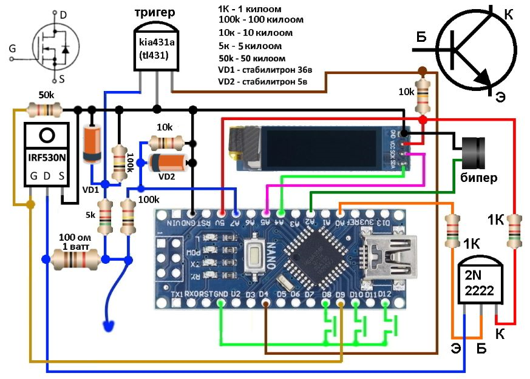

# Car-probe
Car probe with functions of voltmeter, oscilloscope, frequency meter, PWM generator. The function of determining the CAN, LIN bus.

*функции* вольтметр, осцилограф, частотомер со скважностью, генератор с шим, определение кан лин шины, прозвонка на минус, подача плюса для проверки транзисторов, светодиодов и т.д
*Корпус* задуман из самого доступного это шприц 20-30 кубов под него и планируется плата на макетке, контролька прежде всего должна быть доступна максимальному кругу людей.

